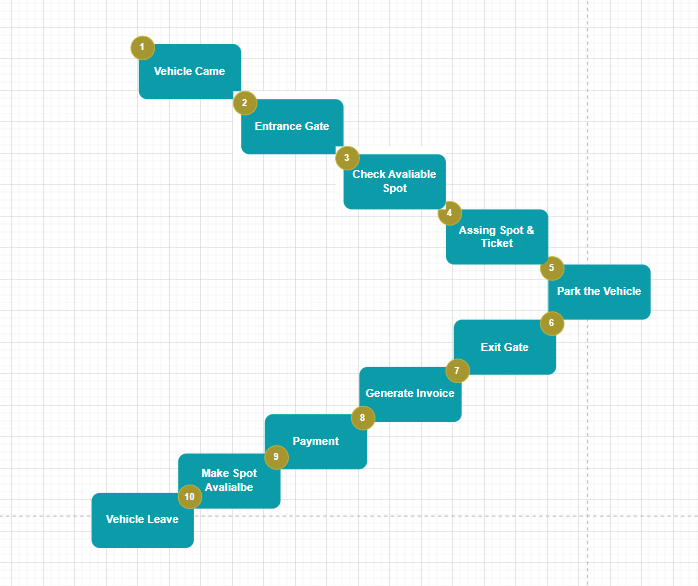
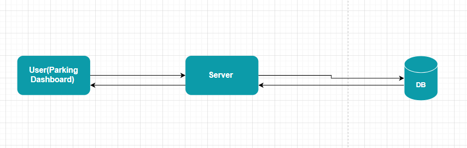

### Simple Flow In layman tersm
1. Vehihcale Came to Entrance Gate
2. Check the Available Parking Slot
3. Assign the spot and give the ticket 
4. Park the Vehicle
5. At Exit Gate generate Invoice 
6. Making the Paymet 
7. Make the spot available
8. Vehicle will Leave.

### High Level Desing

1. I don't want to confuse you at this stage give it very simple and high level
2. We have Parking Lot Dashboard, Which send the request to server and displays in dashboard
3. Server will do all the business logic based on data in datbase and user request 
4. Databse will store the data.

