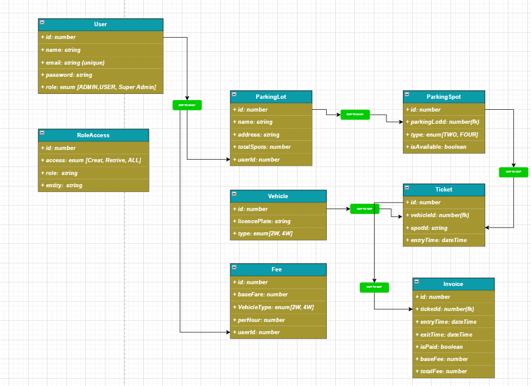

### Database Design
1. It is Self Explanatary diagram, anyway let me read through highlets in each table 
2.  User --> have userIdentitiy information name, email. Mostly importanty Role which associated with certain permission
3.  RoleAccess --> Which indicates with respect to each role we assign permission
    1.  SuperAdmin --> Full access
    2.  Admin --> Except creating the Admin, SuperAdmin And Records in RoleAccess table He have all the permsssion
    3.  User --> 
        1.  Have Read access to follwoing
            1.  RoleAccess
            2.  ParkingLot
            3.  ParkingSpot
        2.  Have update access to following
            1.  ParkingSpot
        3.  Remaing all have he have fullacess but he don't have delete access.
4.  ParkingLot --> it is for whole address and details of parking Lot, total number of spots indicating space in the parking lot 
5.  PakringSpot --> Which is the Specific place where custmer can keep his vehicle based on number of wheels [TWO, FOUR, THREE]
6.  Vehical -->  get vehical details
7.  Ticktet --> link vehicl, parking spot, timing 
8.  Fee -- > basefare table Only Admin, Super Admin have create and update access, user don't have
9.  Invoice --> which keep the charge on the customer