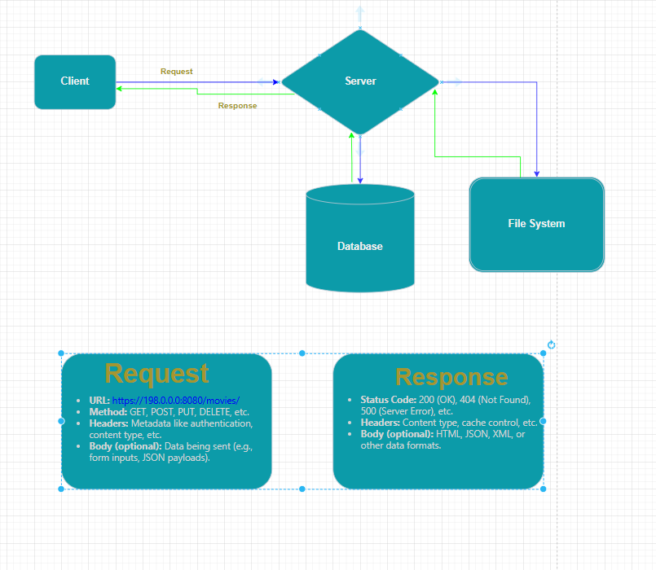

# **Request-Response Model**  

## **Introduction**  
- The **Request-Response** model is a fundamental communication pattern used in **client-server architecture**.  
- It is widely used in web applications, APIs, and distributed systems.  

## **How It Works**  
1. **Client Sends a Request**  
   - The client (e.g., web browser, mobile app) initiates communication by sending a **request** to the server.  
   - This request includes details such as:
     - **URL:** https://198.0.0.0:8080/movies/
     - **Method:** GET, POST, PUT, DELETE, etc.  
     - **Headers:** Metadata like authentication, content type, etc.  
     - **Body (optional):** Data being sent (e.g., form inputs, JSON payloads).  

2. **Server Processes the Request**  
   - The server receives the request, processes it, and interacts with databases or other resources as needed.  

3. **Server Sends a Response**  
   - The server responds with the requested data or an appropriate status message.  
   - The response includes:
     - **Status Code:** 200 (OK), 404 (Not Found), 500 (Server Error), etc.  
     - **Headers:** Content type, cache control, etc.  
     - **Body (optional):** HTML, JSON, XML, or other data formats.  

## **Example** (Web Browsing)  
1. A user types `www.example.com` in a browser.  
2. The browser sends an HTTP GET request to the website’s server.  
3. The server retrieves the requested webpage and sends an HTTP response.  
4. The browser renders the webpage for the user.  

## **Common HTTP Methods**  
- **GET** – Retrieve data  
- **POST** – Submit data  
- **PUT** – Update data  
- **DELETE** – Remove data  

## **Status Codes and Their Meaning**  
- **1xx (Informational)** – Processing requests  
- **2xx (Success)** – Request successful (e.g., 200 OK)  
- **3xx (Redirection)** – Further action needed (e.g., 301 Moved Permanently)  
- **4xx (Client Errors)** – Bad requests (e.g., 404 Not Found)  
- **5xx (Server Errors)** – Server-side issues (e.g., 500 Internal Server Error)  

## **Conclusion**  
- The **Request-Response** model is essential for web communication.  
- Understanding HTTP methods and status codes helps in debugging and optimizing web interactions.  
- It is widely used in REST APIs, web servers, and cloud applications.  

---