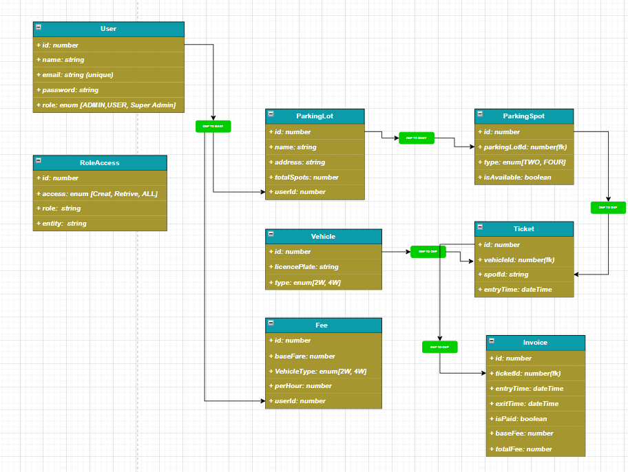

# Parking Lot System — Backend API

A complete REST API backend for managing a parking lot system. Built with **Node.js**, **Express**, and **MongoDB**.

---

## Table of Contents

1. [What does this project do?](#what-does-this-project-do)
2. [Tech Stack](#tech-stack)
3. [Project Structure](#project-structure)
4. [Database Design](#database-design)
5. [Roles and Permissions](#roles-and-permissions)
6. [How to Run the Project](#how-to-run-the-project)
7. [Environment Variables](#environment-variables)
8. [API Endpoints](#api-endpoints)
9. [Business Logic](#business-logic)
10. [Error Handling](#error-handling)
11. [Testing with REST Client](#testing-with-rest-client)

---

## What does this project do?

This is the backend for a **Parking Lot Management System**. It handles:

- User registration and login (with JWT authentication)
- Role-based access (Super Admin, Admin, regular User)
- Managing parking lots and individual parking spots
- Registering vehicles
- Creating parking tickets when a vehicle enters
- Completing tickets when the vehicle exits
- Auto-calculating parking charges and generating invoices
- Marking invoices as paid

Think of it like this:
> A user drives in → gets a ticket → parks → drives out → ticket is completed → invoice is generated → user pays

---

## Tech Stack

| Technology | Purpose |
|---|---|
| Node.js | JavaScript runtime |
| Express.js | Web framework for building APIs |
| MongoDB | Database (NoSQL) |
| Mongoose | MongoDB object modeling |
| JSON Web Token (JWT) | Authentication — proves who you are |
| bcryptjs | Hashing passwords before saving |
| Joi | Validating request data |
| dotenv | Loading environment variables |
| cors | Allowing cross-origin requests |
| morgan | HTTP request logging |
| winston | Application-level logging |

---

## Project Structure

```
Project_Praking_Lot_system/
│
├── server.js                   ← Entry point. Starts the server and connects DB
├── app.js                      ← Registers all routes and middleware
├── .env                        ← Your secret config values (never commit this)
├── api.http                    ← All API requests ready to run in VS Code
├── package.json
│
└── src/
    ├── config/
    │   ├── config.js           ← Reads .env values (PORT, MONGO_URI, JWT_SECRET)
    │   └── db.js               ← Connects to MongoDB
    │
    ├── middleware/
    │   ├── authentication.middleware.js  ← Checks JWT token (are you logged in?)
    │   ├── authorization.middleware.js   ← Checks role (do you have permission?)
    │   ├── validate.middleware.js        ← Validates request body using Joi
    │   └── error.middleware.js           ← Catches all errors and sends clean response
    │
    ├── models/                 ← Mongoose schemas (what data looks like in DB)
    │   ├── User.model.js
    │   ├── RoleAccess.model.js
    │   ├── ParkingLot.model.js
    │   ├── ParkingSpot.model.js
    │   ├── Vehicle.model.js
    │   ├── Ticket.model.js
    │   ├── Fee.model.js
    │   └── Invoice.model.js
    │
    ├── validations/            ← Joi schemas (rules for what data is allowed)
    │   ├── user.validation.js
    │   ├── roleAccess.validation.js
    │   ├── parkingLot.validation.js
    │   ├── parkingSpot.validation.js
    │   ├── vehicle.validation.js
    │   ├── ticket.validation.js
    │   ├── fee.validation.js
    │   └── invoice.validation.js
    │
    ├── services/               ← Business logic (what actually happens)
    │   ├── user.service.js
    │   ├── roleAccess.service.js
    │   ├── parkingLot.service.js
    │   ├── parkingSpot.service.js
    │   ├── vehicle.service.js
    │   ├── ticket.service.js
    │   ├── fee.service.js
    │   └── invoice.service.js
    │
    ├── controllers/            ← Receives request, calls service, sends response
    │   ├── auth.controller.js
    │   ├── user.controller.js
    │   ├── roleAccess.controller.js
    │   ├── parkingLot.controller.js
    │   ├── parkingSpot.controller.js
    │   ├── vehicle.controller.js
    │   ├── ticket.controller.js
    │   ├── fee.controller.js
    │   └── invoice.controller.js
    │
    ├── routes/                 ← URL paths and which controller handles them
    │   ├── auth.routes.js
    │   ├── user.routes.js
    │   ├── roleAccess.routes.js
    │   ├── parkingLot.routes.js
    │   ├── parkingSpot.routes.js
    │   ├── vehicle.routes.js
    │   ├── ticket.routes.js
    │   ├── fee.routes.js
    │   └── invoice.routes.js
    │
    └── utils/
        ├── apiError.js         ← Custom error class with statusCode
        └── jwt.js              ← Signs (creates) JWT tokens
```

### How a request flows through the code

```
Incoming HTTP Request
        |
        v
    Routes             ← Which URL? Which method? (GET, POST, PATCH, DELETE)
        |
        v
   Middleware          ← Is the user logged in? Is the data valid? Does the role allow it?
        |
        v
   Controller          ← Calls the right service function
        |
        v
    Service            ← Actual business logic + DB queries
        |
        v
     Model             ← Mongoose talks to MongoDB
        |
        v
   Controller          ← Sends JSON response back to client
```

---

## Database Design

The schema image above shows all 8 tables (collections) and how they relate.

### User
Stores everyone who uses the system.

| Field | Type | Notes |
|---|---|---|
| name | String | Required, 2–50 chars |
| email | String | Required, unique, lowercase |
| password | String | Required, hashed with bcrypt, never returned |
| role | String | `SUPER_ADMIN`, `ADMIN`, or `USER` (default) |
| createdAt | Date | Auto-added by Mongoose |
| updatedAt | Date | Auto-added by Mongoose |

### RoleAccess
Defines which role can do what on which resource.

| Field | Type | Notes |
|---|---|---|
| role | String | `SUPER_ADMIN`, `ADMIN`, or `USER` |
| resource | String | e.g., `ParkingLot`, `Vehicle` |
| actions | [String] | Array of `CREATE`, `READ`, `UPDATE`, `DELETE` |

### ParkingLot
The physical parking location (building/area).

| Field | Type | Notes |
|---|---|---|
| name | String | Required |
| address | String | Required |
| city | String | Required |
| totalSpots | Number | Required, min 1 |

### ParkingSpot
An individual spot inside a parking lot.

| Field | Type | Notes |
|---|---|---|
| parkingLotId | ObjectId | Links to ParkingLot |
| spotNumber | String | e.g., `T-01`, `F-05` |
| spotType | String | `TWO_WHEELER`, `THREE_WHEELER`, `FOUR_WHEELER` |
| isOccupied | Boolean | `false` by default, `true` when a car is parked |

### Vehicle
A vehicle registered by a user.

| Field | Type | Notes |
|---|---|---|
| userId | ObjectId | Links to User (owner) |
| licensePlate | String | Unique, auto-uppercase |
| vehicleType | String | `TWO_WHEELER`, `THREE_WHEELER`, `FOUR_WHEELER` |
| make | String | e.g., `Honda` |
| model | String | e.g., `Activa` |
| color | String | e.g., `Red` |

### Ticket
Created when a vehicle enters. Completed when it exits.

| Field | Type | Notes |
|---|---|---|
| vehicleId | ObjectId | Links to Vehicle |
| parkingSpotId | ObjectId | Links to ParkingSpot |
| entryTime | Date | Auto-set to now on creation |
| exitTime | Date | Set when ticket is completed |
| status | String | `ACTIVE` (parked) or `COMPLETED` (exited) |

### Fee
The pricing config per vehicle type (set by Admin).

| Field | Type | Notes |
|---|---|---|
| vehicleType | String | Unique — one fee per type |
| baseFare | Number | Flat charge on entry (e.g., ₹20) |
| ratePerHour | Number | Charge per hour (e.g., ₹10/hr) |

### Invoice
The bill generated after a ticket is completed.

| Field | Type | Notes |
|---|---|---|
| ticketId | ObjectId | Links to the completed Ticket |
| userId | ObjectId | Links to User (who is billed) |
| amount | Number | Auto-calculated (see formula below) |
| status | String | `PENDING` or `PAID` |

---

## Roles and Permissions

There are 3 roles in the system. Here is exactly what each role can do:

### SUPER_ADMIN
- Full access to everything
- The only role that can manage `RoleAccess` records
- Can create Admin users
- Can delete anything

### ADMIN
- Can create and manage Parking Lots, Parking Spots, Fees
- Can view all Users, Vehicles, Tickets, Invoices
- Cannot create or modify RoleAccess records
- Cannot create ADMIN or SUPER_ADMIN users

### USER (default for new signups)
- Can register their own vehicles
- Can view Parking Lots and Spots (read only)
- Can create and update Tickets (park and exit)
- Can generate and pay their own Invoices
- Cannot delete anything
- Cannot access other users' data

---

## How to Run the Project

### Step 1 — Make sure you have these installed

- [Node.js](https://nodejs.org) (v18 or above)
- [MongoDB](https://www.mongodb.com) running locally, OR a MongoDB Atlas cloud connection string

### Step 2 — Clone and install dependencies

```bash
cd Project_Praking_Lot_system
npm install
```

### Step 3 — Create your `.env` file

Create a file named `.env` in the `Project_Praking_Lot_system/` folder:

```
PORT=5000
MONGO_URI=mongodb://localhost:27017/parking_lot
JWT_SECRET=your_very_secret_key_here
```

> If you are using MongoDB Atlas, replace `MONGO_URI` with your Atlas connection string.

### Step 4 — Start the server

```bash
npm start
```

You should see:
```
✅ MongoDB connected successfully
🚀 Server running on http://localhost:5000
```

### Step 5 — Test the health check

Open your browser or REST Client and call:
```
GET http://localhost:5000/health
```

Response:
```json
{ "status": "ok" }
```

---

## Environment Variables

| Variable | Description | Default (if not set) |
|---|---|---|
| `PORT` | Port the server runs on | `5000` |
| `MONGO_URI` | MongoDB connection string | `mongodb://localhost:27017/parking_lot` |
| `JWT_SECRET` | Secret key used to sign JWT tokens | `your_jwt_secret_key` |

> Always set a strong `JWT_SECRET` in production. Never use the default.

---

## API Endpoints

All API URLs start with: `http://localhost:5000/api`

### Authentication — `/api/auth`

| Method | URL | Who can call | Description |
|---|---|---|---|
| POST | `/api/auth/login` | Anyone | Login and get a JWT token |
| GET | `/api/auth/profile` | Logged-in user | Get your own profile |

**Login request body:**
```json
{
  "email": "you@example.com",
  "password": "yourpassword"
}
```

**Login response:**
```json
{
  "success": true,
  "message": "Login successful",
  "data": {
    "token": "eyJhbGci...",
    "user": { "id": "...", "name": "...", "email": "...", "role": "USER" }
  }
}
```

> Copy the `token` value. Add it to every request after this as a header:
> `Authorization: Bearer <your_token_here>`

---

### Users — `/api/users`

| Method | URL | Who can call | Description |
|---|---|---|---|
| POST | `/api/users` | Anyone | Register a new user |
| GET | `/api/users` | SUPER_ADMIN, ADMIN | List all users |
| GET | `/api/users/:id` | SUPER_ADMIN, ADMIN | Get user by ID |
| PATCH | `/api/users/:id` | SUPER_ADMIN, ADMIN | Update a user |
| DELETE | `/api/users/:id` | SUPER_ADMIN | Delete a user |

**Create user body:**
```json
{
  "name": "Ravi Kumar",
  "email": "ravi@gmail.com",
  "password": "ravi1234",
  "role": "USER"
}
```

> `role` is optional. Defaults to `USER`. Only SUPER_ADMIN should set `ADMIN` or `SUPER_ADMIN`.

---

### Role Access — `/api/role-access`

| Method | URL | Who can call | Description |
|---|---|---|---|
| POST | `/api/role-access` | SUPER_ADMIN | Create a role-access entry |
| GET | `/api/role-access` | All logged-in | List all role-access entries |
| GET | `/api/role-access/:id` | All logged-in | Get by ID |
| PATCH | `/api/role-access/:id` | SUPER_ADMIN | Update actions |
| DELETE | `/api/role-access/:id` | SUPER_ADMIN | Delete entry |

**Create body:**
```json
{
  "role": "USER",
  "resource": "ParkingSpot",
  "actions": ["READ", "UPDATE"]
}
```

---

### Parking Lots — `/api/parking-lots`

| Method | URL | Who can call | Description |
|---|---|---|---|
| POST | `/api/parking-lots` | ADMIN, SUPER_ADMIN | Create a parking lot |
| GET | `/api/parking-lots` | All logged-in | List all parking lots |
| GET | `/api/parking-lots/:id` | All logged-in | Get one parking lot |
| PATCH | `/api/parking-lots/:id` | ADMIN, SUPER_ADMIN | Update a parking lot |
| DELETE | `/api/parking-lots/:id` | ADMIN, SUPER_ADMIN | Delete a parking lot |

**Create body:**
```json
{
  "name": "Downtown Parking Plaza",
  "address": "123 Main Street",
  "city": "Hyderabad",
  "totalSpots": 50
}
```

---

### Parking Spots — `/api/parking-spots`

| Method | URL | Who can call | Description |
|---|---|---|---|
| POST | `/api/parking-spots` | ADMIN, SUPER_ADMIN | Create a spot inside a lot |
| GET | `/api/parking-spots` | All logged-in | List spots (filterable) |
| GET | `/api/parking-spots/:id` | All logged-in | Get one spot |
| PATCH | `/api/parking-spots/:id` | All logged-in | Update spot (e.g., isOccupied) |
| DELETE | `/api/parking-spots/:id` | ADMIN, SUPER_ADMIN | Delete a spot |

**Create body:**
```json
{
  "parkingLotId": "<parking_lot_id>",
  "spotNumber": "T-01",
  "spotType": "TWO_WHEELER"
}
```

**Filter available spots by query params:**
```
GET /api/parking-spots?spotType=TWO_WHEELER&isOccupied=false&parkingLotId=<id>
```

`spotType` values: `TWO_WHEELER`, `THREE_WHEELER`, `FOUR_WHEELER`

---

### Vehicles — `/api/vehicles`

| Method | URL | Who can call | Description |
|---|---|---|---|
| POST | `/api/vehicles` | Any logged-in user | Register your vehicle |
| GET | `/api/vehicles/my` | Any logged-in user | Get your own vehicles |
| GET | `/api/vehicles` | ADMIN, SUPER_ADMIN | List all vehicles |
| GET | `/api/vehicles/:id` | All logged-in | Get a vehicle by ID |
| PATCH | `/api/vehicles/:id` | All logged-in | Update vehicle details |
| DELETE | `/api/vehicles/:id` | ADMIN, SUPER_ADMIN | Delete a vehicle |

**Register vehicle body:**
```json
{
  "licensePlate": "TS09AB1234",
  "vehicleType": "TWO_WHEELER",
  "make": "Honda",
  "model": "Activa",
  "color": "Red"
}
```

> You do not need to send `userId`. It is automatically taken from your login token.

---

### Tickets — `/api/tickets`

| Method | URL | Who can call | Description |
|---|---|---|---|
| POST | `/api/tickets` | Any logged-in user | Park a vehicle (create ticket) |
| GET | `/api/tickets` | All logged-in | List all tickets |
| GET | `/api/tickets/:id` | All logged-in | Get a ticket by ID |
| PATCH | `/api/tickets/:id` | All logged-in | Update ticket (complete/exit) |
| DELETE | `/api/tickets/:id` | ADMIN, SUPER_ADMIN | Delete a ticket |

**Create ticket (entry) body:**
```json
{
  "vehicleId": "<your_vehicle_id>",
  "parkingSpotId": "<available_spot_id>"
}
```

> The system checks that the vehicle type matches the spot type.
> The spot is automatically marked as **occupied** (`isOccupied: true`).

**Complete ticket (exit) body:**
```json
{
  "status": "COMPLETED",
  "exitTime": "2026-03-22T12:00:00.000Z"
}
```

> The spot is automatically **freed** (`isOccupied: false`).
> If you don't send `exitTime`, it is set to the current time automatically.

---

### Fees — `/api/fees`

| Method | URL | Who can call | Description |
|---|---|---|---|
| POST | `/api/fees` | ADMIN, SUPER_ADMIN | Set fee for a vehicle type |
| GET | `/api/fees` | All logged-in | View all fee configs |
| GET | `/api/fees/:id` | All logged-in | Get fee by ID |
| PATCH | `/api/fees/:id` | ADMIN, SUPER_ADMIN | Update fee |
| DELETE | `/api/fees/:id` | SUPER_ADMIN | Delete fee |

**Create fee body:**
```json
{
  "vehicleType": "TWO_WHEELER",
  "baseFare": 20,
  "ratePerHour": 10
}
```

> One fee entry per vehicle type. Trying to create a duplicate returns a 409 error.

---

### Invoices — `/api/invoices`

| Method | URL | Who can call | Description |
|---|---|---|---|
| POST | `/api/invoices/generate` | Any logged-in user | Auto-generate invoice for your completed ticket |
| POST | `/api/invoices` | ADMIN, SUPER_ADMIN | Manually create invoice |
| GET | `/api/invoices/my` | Any logged-in user | View your own invoices |
| GET | `/api/invoices` | ADMIN, SUPER_ADMIN | View all invoices |
| GET | `/api/invoices/:id` | All logged-in | Get invoice by ID |
| PATCH | `/api/invoices/:id` | All logged-in | Update invoice (pay it) |
| DELETE | `/api/invoices/:id` | ADMIN, SUPER_ADMIN | Delete invoice |

**Generate invoice body:**
```json
{
  "ticketId": "<your_completed_ticket_id>"
}
```

> The ticket must have `status: COMPLETED` before you can generate an invoice.
> Amount is auto-calculated. See the formula below.

**Pay an invoice body:**
```json
{
  "status": "PAID"
}
```

---

## Business Logic

### Invoice Amount Calculation

When you call `POST /api/invoices/generate`, the system:

1. Finds the ticket (must be COMPLETED)
2. Gets the vehicle's type from the ticket
3. Looks up the Fee for that vehicle type
4. Calculates hours parked (rounds **up** to nearest hour)
5. Calculates amount:

```
amount = baseFare + ( ceil(hoursParked) × ratePerHour )
```

**Example:**
- Vehicle type: `TWO_WHEELER`
- Fee: baseFare = ₹20, ratePerHour = ₹10
- Entry: 10:00 AM, Exit: 12:30 PM → 2.5 hours → rounded up to 3 hours
- Amount = 20 + (3 × 10) = **₹50**

---

### Ticket and Spot Occupancy

When a **Ticket is created**:
- System checks the vehicle type matches the spot type
- System checks the spot is not already occupied
- Spot `isOccupied` is set to `true` automatically

When a **Ticket is completed** (status → COMPLETED):
- Spot `isOccupied` is set to `false` automatically
- `exitTime` is recorded (auto-set to now if not provided)

---

## Error Handling

Every error response has this shape:

```json
{
  "success": false,
  "message": "What went wrong",
  "details": ["optional array of specific issues"]
}
```

| HTTP Status | Meaning |
|---|---|
| 400 | Bad request — validation failed or wrong data sent |
| 401 | Unauthorized — not logged in or token expired |
| 403 | Forbidden — logged in but not allowed to do this |
| 404 | Not found — resource does not exist |
| 409 | Conflict — duplicate data (e.g., email already exists) |
| 500 | Internal server error — something unexpected happened |

---

## Testing with REST Client

The file `api.http` contains every API request pre-written and ready to run.

### Install the extension

Search for **REST Client** by *Huachao Mao* in VS Code extensions and install it.

### How to run a request

1. Open `api.http` in VS Code
2. You will see **"Send Request"** above every request block
3. Click it — the response appears in a panel on the right

### Auto-captured variables (no copy-paste needed)

The file uses named requests to capture tokens and IDs automatically:

```http
# @name loginSuperAdmin
POST http://localhost:5000/api/auth/login
...

@superAdminToken = {{loginSuperAdmin.response.body.data.token}}
```

After you run `[1.2] Login Super Admin`, the token is stored in `@superAdminToken` and used in every request that needs it.

### Recommended run order

```
Phase 1 — First time only (Super Admin bootstrap)
  Run [1.1] → [1.2] → [1.4] → [1.5] to [1.9]

Phase 2 — Admin sets up parking infrastructure
  Run [2.1] → [2.2] → [2.6] → [2.7] → [2.8] → [2.11] → [2.12] → [2.13]

Phase 3 — User parks and pays
  Run [3.1] → [3.2] → [3.4] → [3.7] → [3.10] → [3.12] → [3.15]

Phase 4 — Admin oversight
  Run [4.1] to [4.4] anytime after Phase 2
```

---

## Common Mistakes and Fixes

| Problem | Fix |
|---|---|
| `401 Authentication required` | You forgot to send the `Authorization: Bearer <token>` header |
| `403 You do not have permission` | Your role is not allowed to do this action |
| `400 Vehicle type does not match spot type` | Pick a spot whose `spotType` matches your vehicle's `vehicleType` |
| `400 Parking spot is already occupied` | Choose a different spot where `isOccupied` is `false` |
| `400 Invoice can only be generated for completed tickets` | First complete the ticket (PATCH status to COMPLETED), then generate invoice |
| `409 Email already exists` | Use a different email |
| `409 Fee for this vehicle type already exists` | You already created a fee for that type. Use PATCH to update it |
| Server does not start | Check that MongoDB is running and `.env` file exists |
